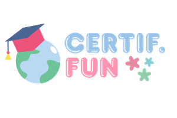

<div align="center">
  
  <h1>🎓 Certif-fun</h1>
  <p><strong>Écosystème Intelligent de Certification Numérique et d'Apprentissage Assisté par IA</strong></p>
  
  [](https://www.oracle.com/java/)
  [](https://spring.io/projects/spring-boot)
  [](https://reactjs.org/)
  [](https://fastapi.tiangolo.com/)
  [](https://ultralytics.com/)
  [](https://www.docker.com/)
</div>

<br>

**Certif-fun** est une plateforme de certification en ligne de nouvelle génération qui réconcilie l'intégrité des évaluations à distance avec une expérience pédagogique fluide. Grâce à une architecture microservices et une intelligence artificielle multi-modale, elle offre un environnement de confiance pour les institutions et une assistance intelligente pour les formateurs.

---

## 📖 Sommaire
- [🎯 Contexte et Objectifs](#-contexte-et-objectifs)
- [✨ Fonctionnalités Clés](#-fonctionnalités-clés)
- [🏗️ Architecture du Système](#️-architecture-du-système)
- [🛠️ Stack Technologique](#️-stack-technologique)
- [🚀 Performances et Tests (CI/CD)](#-performances-et-tests-cicd)
- [🖼️ Aperçu de l'Interface](#️-aperçu-de-linterface)
- [🚦 Démarrage Rapide](#-démarrage-rapide)
- [👤 Auteur & Encadrement](#-auteur--encadrement)

---

## 🎯 Contexte et Objectifs

La transformation numérique de l'éducation a révélé des lacunes critiques dans les outils de gestion de l'apprentissage (LMS) traditionnels : fragmentation des outils, absence d'IA native pour l'assistance pédagogique, et vulnérabilité des examens à distance.

**Certif-fun** répond à ces défis avec un objectif multidimensionnel :
1. **Surveillance intelligente** : Détection automatique de fraude.
2. **Génération de contenu** : Création instantanée de quiz et résumés via LLM.
3. **Espace Collaboratif** : Système de visioconférence intégré et module de suivi de progression structuré.

---

## ✨ Fonctionnalités Clés

### 🛡️ Surveillance IA et Anti-Triche (AI Proctoring)
Le système ne se contente pas d'enregistrer la webcam, il **comprend** l'environnement de l'étudiant en quasi-temps réel :
- **Vision (YOLOv8 & MediaPipe) :** Détection d'objets interdits (téléphones, livres), présence multiple et suivi précis du regard (Gaze estimation).
- **Anti-Absence :** Alerte visuelle et arrêt automatique de l'examen en cas d'infraction.
- **Surveillance du Navigateur :** Détection des changements d'onglets ou de la sortie du mode plein écran.

### 🤖 Assistant Pédagogique LLM (IA Générative)
Intégration locale via **Ollama** pour garantir la confidentialité absolue des données :
- Génération automatique de quiz à partir de supports de cours (format JSON).
- Support de modèles locaux ultra-légers et performants : **Mistral 7B**, **Llama 3.2** et **Qwen 2.5**.

### 📹 Visioconférence et Classes Virtuelles
- Sessions vidéo en direct rendues possibles par la technologie **LiveKit (WebRTC)**.
- Architecture SFU (Selective Forwarding Unit) pour alléger la consommation CPU et garantir une qualité audio/vidéo stable.

### 👨‍💻 Espace Coding Expert
- Éditeur de code en ligne interactif (Sandbox) avec exécution sécurisée pour les formations en informatique (Python, Java, etc.).

---

## 🏗️ Architecture du Système

Certif-fun repose sur une architecture distribuée moderne et conteneurisée, assurant scalabilité, isolation et maintenabilité :

<p align="center">
  
</p>

L'architecture est structurée en 4 couches majeures :
1. **Presentation Layer (React)** : 3 portails web (Apprenant, Formateur, Admin).
2. **Microservices Layer (Spring Boot)** : 3 microservices Java métier gérant chacun un domaine spécifique.
3. **AI & Media Layer** : Module Python FastAPI (YOLOv8), serveur LiveKit (SFU), et API Ollama.
4. **Persistence Layer** : Base de données relationnelle PostgreSQL.

---

## 🛠️ Stack Technologique

| Couche | Technologies |
| :--- | :--- |
| **Backends** | Java 21, Spring Boot 3, Spring Security (JWT), JPA/Hibernate |
| **Frontends** | React 18, TypeScript, Vite, Tailwind CSS |
| **Intelligence Artificielle**| Python 3.9, FastAPI, YOLOv8, MediaPipe, OpenCV, Ollama |
| **Données & Stockage** | PostgreSQL 15, S3-like local storage |
| **Média & Temps Réel** | WebRTC, LiveKit SFU |
| **Infrastructure & DevOps** | Docker, Docker Compose, Nginx (Proxy Inverse), Jenkins |
| **Tests** | JUnit 5, Mockito, Pytest, Newman, Testcontainers |

---

## 🚀 Performances et Tests (CI/CD)

La fiabilité et la performance de Certif-fun ont été prouvées par des tests rigoureux :

- **Performance IA :** Cadence d'inférence de **28.2 FPS** avec une latence moyenne de ~35ms par image, garantissant une détection fluide et réactive. Échantillonnage intelligent pour optimiser les ressources CPU.
- **Tests Unitaires et d'Intégration :** Plus de 100 tests (JUnit & Pytest) avec une couverture de code > 90%. Validation des requêtes SQL via **Testcontainers**.
- **Automatisation CI/CD :** Pipeline Jenkins complet (Build, Tests, Déploiement) s'exécutant en moins de 3 minutes.
- **Tests End-to-End :** Validation automatisée des workflows métiers via **Newman**.

<p align="center">
  
</p>

---

## 🖼️ Aperçu de l'Interface

### 1. Surveillance IA (Proctoring)
<p align="center">
  
  <br><i>Suivi du regard et détection d'objets en temps réel via YOLOv8 et MediaPipe.</i>
</p>

### 2. Multi-portails Unifiés
<p align="center">
  
  <br><i>Accès centralisé pour Admin, Formateur et Apprenant.</i>
</p>

### 3. Visioconférence (LiveKit)
<p align="center">
  
</p>

---

## 🚦 Démarrage Rapide

### 1. Pré-requis
- Docker Desktop et Docker Compose.
- [Ollama](https://ollama.com/) installé localement (pour les fonctions IA génératives).
- Au moins 16 Go de RAM recommandés.

### 2. Lancement
```bash
# Cloner le dépôt
git clone https://github.com/anas-khaiy/Certificate.git
cd Certificate

# Lancer tous les services via Docker Compose
docker-compose up --build -d
```

### 3. Accès aux Portails
L'infrastructure utilise Nginx comme proxy inverse. Les accès par défaut (selon la configuration) sont :
- **Apprenant :** `http://localhost:6173`
- **Formateur :** `http://localhost:6174`
- **Admin :** `http://localhost:6175`

*(Note: Les ports peuvent varier selon votre configuration `docker-compose.yml`)*

---

## 👤 Auteur & Encadrement

Ce projet a été réalisé dans le cadre du **Master Didactique des Sciences et Ingénierie Éducative (MSDIE)** de l'École Normale Supérieure (ENS) de Marrakech, Université Cadi Ayyad.

- **Auteur :** Anas KHAIY
- **Encadrant :** Pr. LAANAOUI My Driss

---
<p align="center">
  © 2026 Certif-fun — Conçu pour l'excellence pédagogique et l'intégrité numérique.
</p>
